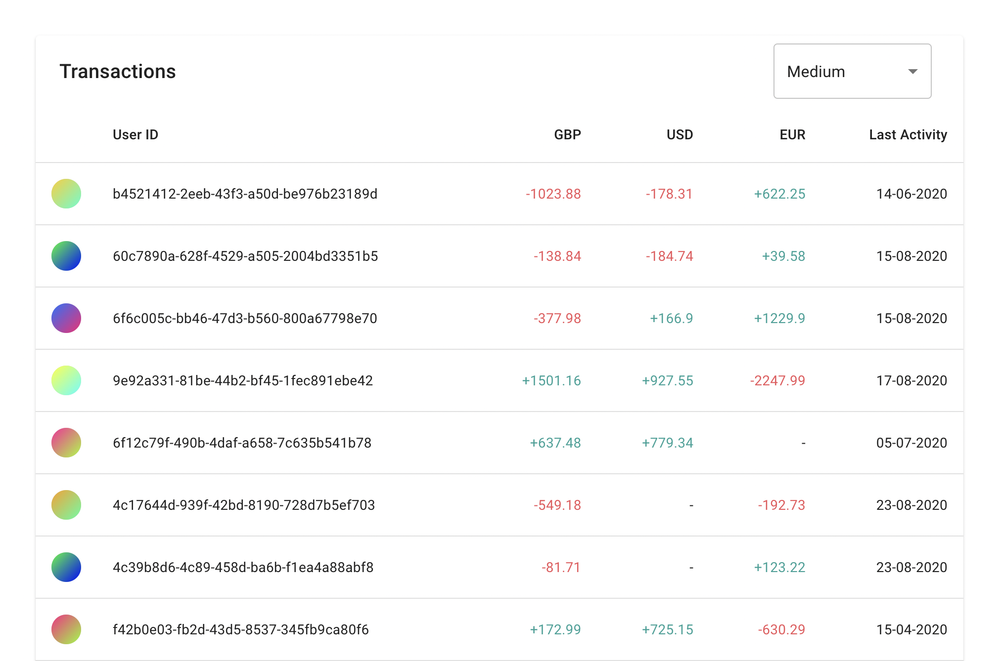

# Monolith Exercise - React
Please perform this exercise in a private fork of this repository and share it with us here at Monolith.

## The task
Create a React app that fetches data containing a list of card transactions for a group of users. Process the transactions and compute the final balance for each user. Display the final balances in the app in a sensible way for a fraud department to review.

## Demo
[Click Here](https://du5rte.github.io/monolith-exercise-react-app/)

## Assumptions
- A user can have multiple transactions.
- A user can have transactions in multiple currencies.
- There are no duplicated transactions. Two transactions with the same timestamp for the same user are 2 distinct transactions.
- We assume the currencies are limited to: GBP, EUR, USD.

## Decisions
- Added ability to switch between different lists
- Added loading state to the tablet using skeleton
- Added avatar to users ids for a better looking app

## Libraries used

- [Google Material UI](https://mui.com)
- [decimal.js](https://mikemcl.github.io/decimal.js/)
- [Day.js](https://day.js.org/)
- [axios](https://axios-http.com/)
- [Avatar Generator by Varld](https://gradient-avatar.glitch.me/)
- [GitHub Actions](https://github.com/features/actions)
